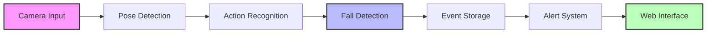

# FallSense - Hệ Thống Phát Hiện Té Ngã Thông Minh 🎯

<div align="center">

[](https://www.python.org/)
[](https://pytorch.org/)
[](https://flask.palletsprojects.com/)
[](https://www.mongodb.com/)
[](https://github.com/shyncomputer/fall_detection/issues)
[](https://github.com/shyncomputer/fall_detection/stargazers)
[](https://opensource.org/licenses/MIT)

</div>

## 📑 Mục Lục

- [Giới Thiệu](#-giới-thiệu)
- [Tính Năng](#-tính-năng)
- [Quy Trình Hoạt Động](#-quy-trình-hoạt-động)
- [Cài Đặt](#-cài-đặt)
- [Cấu Trúc Dự Án](#-cấu-trúc-dự-án)
- [Chạy Ứng Dụng](#-chạy-ứng-dụng)
- [Đóng Góp](#-đóng-góp)
- [Liên Hệ](#-liên-hệ)
- [Giấy Phép](#-giấy-phép)

## 📝 Giới Thiệu

FallSense là một hệ thống phát hiện té ngã thông minh sử dụng trí tuệ nhân tạo, được phát triển bởi Shyn (nguyentrongphuoc.ai@gmail.com). Hệ thống có khả năng theo dõi nhiều người cùng lúc và phát hiện các sự kiện té ngã trong thời gian thực, giúp cảnh báo kịp thời cho người giám sát.

## 🌟 Tính Năng

- 🎯 **Phát hiện té ngã**: Phát hiện té ngã thời gian thực với độ chính xác cao
- 👥 **Theo dõi đa người**: Theo dõi nhiều người cùng lúc, phân biệt từng cá nhân
- 📊 **Lịch sử sự kiện**: Ghi nhận và lưu trữ chi tiết các sự kiện té ngã
- 🔐 **Xác thực người dùng**: Hệ thống bảo mật với đăng nhập/đăng ký
- 📱 **Giao diện responsive**: Tương thích với mọi thiết bị, dễ sử dụng

## 🔄 Quy Trình Hoạt Động



## 🛠 Cài Đặt

### Yêu Cầu Hệ Thống
- Windows 10/11 (64-bit)
- NVIDIA GPU (Kiểm tra khả năng tương thích CUDA tại https://developer.nvidia.com/cuda-gpus)
- Ổ cứng trống tối thiểu 10GB
- RAM tối thiểu 8GB (khuyến nghị 16GB)

### Cài Đặt Môi Trường

1. **Cài đặt Anaconda**
   - Tải Anaconda từ [trang chủ](https://www.anaconda.com/download)
   - Chọn phiên bản Python 3.10 64-bit (bắt buộc)
   - Trong quá trình cài đặt, chọn "Add Anaconda to PATH"

2. **Cài đặt CUDA và cuDNN**
   - Kiểm tra phiên bản CUDA tương thích với GPU của bạn
   - Tải và cài đặt CUDA Toolkit từ [NVIDIA Developer](https://developer.nvidia.com/cuda-toolkit-archive)
   - Tải cuDNN tương ứng từ [NVIDIA Developer](https://developer.nvidia.com/cudnn)
   - Giải nén và cài đặt cuDNN theo hướng dẫn của NVIDIA
   - Thêm đường dẫn CUDA vào PATH hệ thống

3. **Cài đặt MongoDB**
   - Tải [MongoDB Community Server](https://www.mongodb.com/try/download/community)
   - Chọn "Complete" installation và "Run service as Network Service user"
   - MongoDB sẽ tự động chạy như một Windows Service

### Cài Đặt Dự Án

```bash
# Clone repository
git clone https://github.com/shyncomputer/fall_detection.git
cd fall_detection

# Tạo và kích hoạt môi trường Anaconda
conda create -n fallsense python=3.10
conda activate fallsense

# Cài đặt PyTorch với CUDA support
# Truy cập https://pytorch.org/get-started/locally/ để chọn lệnh cài đặt phù hợp với phiên bản CUDA của bạn
# Ví dụ cho CUDA 11.8:
conda install pytorch torchvision torchaudio pytorch-cuda=11.8 -c pytorch -c nvidia

# Cài đặt các dependencies khác
pip install -r requirements.txt
```

### Cấu Hình Hệ Thống

1. **Cấu hình MongoDB**
   ```bash
   # Kiểm tra MongoDB đã chạy
   mongosh
   # Nếu kết nối thành công, thoát bằng lệnh: exit
   ```

2. **Cấu hình môi trường**
   - Tạo file `.env` trong thư mục gốc với các cấu hình sau:
   ```env
   # Cấu hình MongoDB
   MONGODB_URI=mongodb://localhost:27017/fallsense  # URI kết nối MongoDB
   MONGODB_DB=fallsense                            # Tên database
   MONGODB_COLLECTION=fall_events                   # Collection lưu sự kiện té ngã

   # Cấu hình xác thực
   SECRET_KEY=your_secret_key_here                  # Khóa bí mật cho JWT token
   TOKEN_EXPIRE_MINUTES=1440                        # Thời gian hết hạn token (24 giờ)

   # Cấu hình camera
   CAMERA_SOURCE=0                                  # 0: webcam, rtsp://user:pass@ip:port: camera IP
   CAMERA_WIDTH=640                                 # Độ rộng khung hình
   CAMERA_HEIGHT=480                               # Độ cao khung hình
   CAMERA_FPS=30                                   # Số khung hình/giây

   # Cấu hình AI model
   MODEL_PATH=runs/ST_GCN_action.pt                # Đường dẫn đến model ST-GCN
   POSE_MODEL=yolo11s-pose.pt                      # Model YOLO cho pose estimation
   DETECTION_THRESHOLD=0.5                         # Ngưỡng phát hiện té ngã

   # Cấu hình lưu trữ
   SAVE_IMAGES=true                                # Lưu ảnh khi phát hiện té ngã
   IMAGES_DIR=static/fall_images                   # Thư mục lưu ảnh

   # Cấu hình hệ thống
   DEBUG=true                                      # Chế độ debug
   LOG_LEVEL=INFO                                  # Mức độ log
   ```

3. **Kiểm tra cài đặt**
   ```bash
   # Kiểm tra CUDA
   python -c "import torch; print('CUDA available:', torch.cuda.is_available())"
   # Nếu hiển thị "CUDA available: True" là đã cài đặt thành công
   ```

## 📁 Cấu Trúc Dự Án

```
fall_detection/
├── models/              # Các model AI
│   ├── stgcn.py        # ST-GCN model
│   └── Utils.py        # Utility functions
├── modules/            # Core modules
│   ├── camera.py       # Camera handling
│   ├── database.py     # Database operations
│   └── fall_detection.py # Fall detection logic
├── static/            # Frontend assets
│   ├── css/          # Stylesheets
│   ├── js/           # JavaScript files
│   └── fall_images/  # Captured fall events
├── auth.py           # Authentication
├── backend.py        # Backend API
├── config.yaml       # Configuration
└── requirements.txt  # Dependencies
```

## 🚀 Chạy Ứng Dụng

```bash
# Kích hoạt môi trường Anaconda
conda activate fallsense

# Khởi động server
python backend.py
```

Truy cập ứng dụng tại `http://localhost:5000`

> 💡 **Lưu ý**: Đảm bảo MongoDB service đang chạy trước khi khởi động ứng dụng

## 👥 Đóng Góp

Mọi đóng góp đều được hoan nghênh! Vui lòng tạo issue hoặc pull request.

## 📧 Liên Hệ

- **Tác giả:** Shyn
- **Email:** nguyentrongphuoc.ai@gmail.com

## 📄 Giấy Phép

Dự án này được phân phối dưới giấy phép MIT. Xem file `LICENSE` để biết thêm chi tiết.